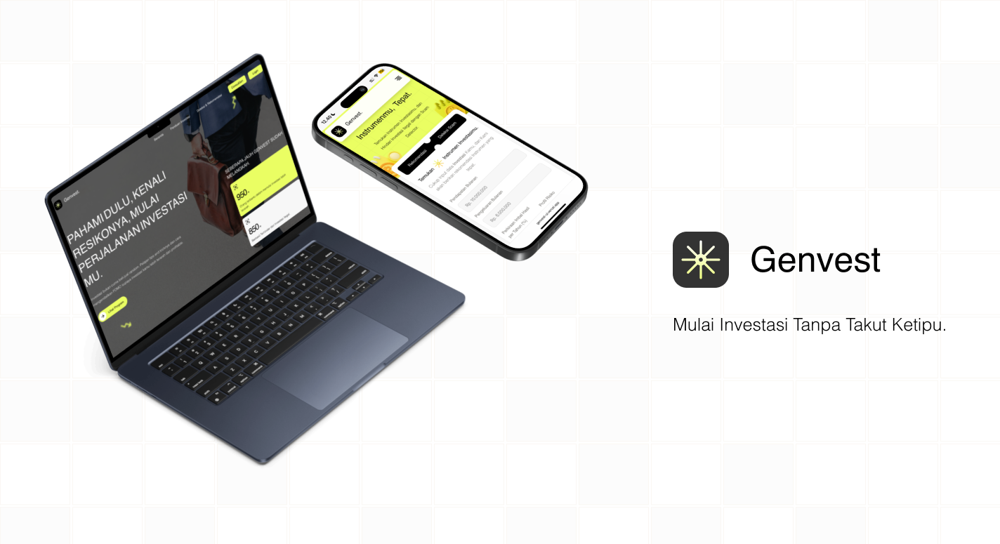

<h2> 🚀 Genvest - Mulai Investasi Tanpa Takut Ketipu </h2>

Genvest adalah platform edukasi investasi untuk Gen Z.  
Membantu kamu memahami investasi dengan cara yang simpel, mengendalikan FOMO, dan menghindari jebakan investasi ilegal.

<h3>📦 Cara Menjalankan Project </h3>

<h4> 🤔 1. Buka dari Repo / Download File Project </h4>

1. Clone repo atau download file project:

   ```bash
   git clone https://github.com/nandah4/genvest.ui.git

   ```

2. Masuk ke folder project:

   ```bash
   cd genvest.ui

   ```

3. Install dependencies node:

   ```bash
   npm install

   ```

4. Jalankan development server di terminal, ketik:

   ```bash
   npm run dev

   ```

5. Buka di browser:
   http://localhost:3000...

<h4> 🤔 2. Buka dari Hosting </h4>
Salin URL di bawah ini, dan paste di web browser mu:

```bash
https://genvest-ui.vercel.app/

```

<h4> 💪 3. Fitur dan Teknologi </h4>

- **Responsive Design** – Optimal di semua device (Mobile, Tablet, dan Desktop)
- **Modern Styling and Animation Framework** – Framer untuk animasi dan Tailwindcss untuk styling yang konsisten
- **Interactive Contents** – Hook dan Framer untuk membantu dalam pembuatan konten yang dinamis


<h4> 🤔 4. Flow Pengguna </h4>

1. Buka website → masuk ke halaman beranda.

2. Login → untuk bisa menggunakan fitur ConsulGen. (Klik Masuk dengan Email)

3. Jelajahi Beranda → temukan informasi utama dan highlight fitur.

4. Panduan Edukasi → pelajari dasar-dasar investasi dengan konten edukatif.

5. Deteksi & Rekomendasi → cek apakah investasi legal & temukan instrumen sesuai profilmu.

6. ConsulGen → konsultasi interaktif tentang investasi dengan AI. (Klik Profile untuk kembali ke Beranda)

7. Selesai 🎉 → Selamat mencoba fitur-fitur Genvest 🚀
